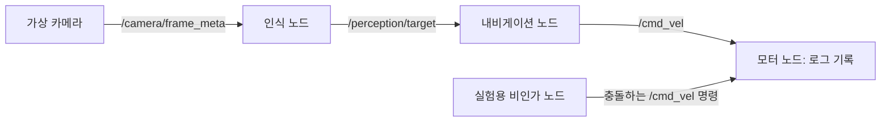
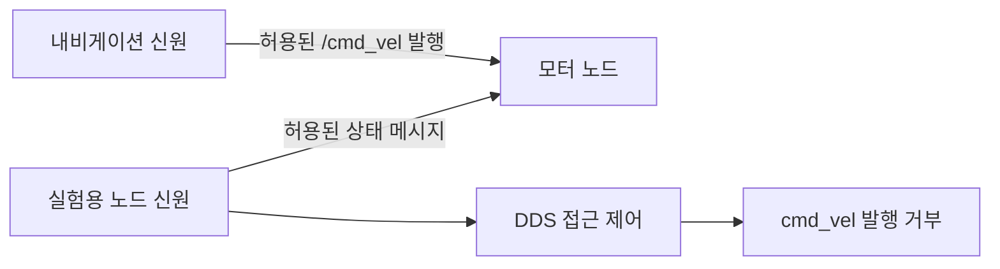

# Secure ROS2 Robot

비인가 발행자가 보안이 적용되지 않은 로봇 명령 채널에 미치는 영향과,
SROS2 / DDS Security의 인증·암호화·권한 부여·최소 권한 정책으로 이를
완화하는 방법을 비교하는 재현 가능한 ROS 2 보안 실습 환경입니다.

## 개요

네 개의 C++ 노드로 카메라부터 모터까지의 통신 흐름을 구성합니다.
실험용 Python 노드는 같은 DDS 도메인에서 정상 명령과 충돌하는 `Twist`
메시지를 발행합니다. 모터 노드는 수신한 명령을 로그로만 기록하며,
실제 하드웨어를 제어하지 않습니다.

동일한 로봇 구성을 DDS Security 비활성화 상태와 강제 적용 상태에서
실행한 뒤, 모터 로그를 비교하도록 설계했습니다.

**검증 상태:** 구현은 작성되었지만, 개발에 사용한 Windows 환경에서는
ROS 패키지 빌드와 실제 통신 실험을 실행하지 못했습니다.
실제로 수행한 검사와 환경 제약은 [검증 보고서](docs/validation.md)에
기록했습니다. 아래의 예상 로그와 결과는 실험에서 수집한 증거가 아닙니다.

## 프로젝트 목적

ROS 2는 중앙 ROS master 대신 분산 탐색과 DDS 통신을 사용합니다.
보안이 없는 도메인에 접근할 수 있는 참여자는 노드를 탐색하고,
기존 토픽에 맞는 발행자를 생성할 수 있습니다. 도메인 ID는 탐색 범위를
구분하지만 참여자의 신원을 인증하지는 않습니다.

이 프로젝트는 이러한 신뢰 가정을 실험으로 관찰하고, 참여자 신원과
리소스별 권한 정책을 적용했을 때의 차이를 확인하는 데 목적이 있습니다.

## 보안 실습 범위

실습은 전용 내부 Docker 브리지에서 실행하는 가상 노드로 한정합니다.
외부 시스템 대상 지정, LAN 스캔, 취약점 악용, 실제 센서나 구동 장치
연동 기능은 구현하지 않았습니다.

실험용 비인가 노드는 대상 지정 옵션을 제공하지 않으며, 실습 범위 표시와
도메인 42 설정이 없으면 시작하지 않습니다. 이 표시는 잘못된 실행을
방지하기 위한 장치이며, 실제 통신 격리는 Docker 네트워크가 담당합니다.
이 서비스를 실제 로봇 네트워크에 연결하지 마세요.

## 아키텍처

보안을 적용하지 않은 구성에서는 두 발행자의 명령이 동일한 명령 토픽에
도달할 수 있습니다.



보안을 적용한 구성에서는 실험용 노드에 유효한 신원과 상태 메시지 발행
권한을 부여하되, `/cmd_vel` 발행 권한은 거부합니다.



세부 구성은 [아키텍처 문서](docs/architecture.md)를 참고하세요.

## ROS 2 통신 모델

| 발행 노드 | 토픽 | 메시지 타입 | 구독 노드 |
|---|---|---|---|
| camera_node | /camera/frame_meta | std_msgs/String | perception_node |
| perception_node | /perception/target | geometry_msgs/PointStamped | navigation_node |
| navigation_node | /cmd_vel | geometry_msgs/Twist | motor_node |
| attacker_node | /cmd_vel | geometry_msgs/Twist | motor_node, 비보안 모드에서만 수신 예상 |
| attacker_node | /lab/attacker/status | std_msgs/String | motor_node |

애플리케이션의 발행·구독 엔드포인트는 모두 reliable, keep-last depth 10
QoS를 사용합니다. 카메라 메타데이터는 1 Hz로 생성하며, 유효한 프레임마다
타깃 정보와 내비게이션 명령을 생성합니다. 실험용 노드는 시작 후 5초를
기다린 다음 5 Hz로 명령 발행을 시도합니다. 타깃 위치는 가상 상수값이며,
실제 제어기나 물리 시뮬레이터를 구현한 것은 아닙니다.

미들웨어는 `rmw_fastrtps_cpp` 기반 Fast DDS를 사용합니다. 공식 Jazzy
배포판에서 제공하며 SROS2를 통한 DDS Security를 지원하기 때문입니다.
XML 참여자 프로파일에서 UDPv4를 선택하고 공유 메모리 전송을 비활성화하여,
브리지로 연결된 개별 컨테이너 간 통신과 패킷 분석 조건을 맞춥니다.

Compose 구성과 실험용 노드의 `ROS_DOMAIN_ID`는 42로 고정되어 있습니다.
`.env.example`은 설정값을 안내하며, 임의의 원격 도메인을 지정하는 옵션은
제공하지 않습니다.

## 위협 시나리오

정상 내비게이션 명령은 `linear.x=0.20, angular.z=0.00`입니다.
실험용 비인가 노드는 `linear.x=0.80, angular.z=1.00`을 발행합니다.
DDS 접근 제어가 없으면 두 발행자의 메시지가 모터에 도달할 수 있습니다.

이 실험은 해당 위협 모델에서의 비인가 명령 발행을 다룹니다.
모든 ROS 시스템에 적용되는 범용 취약점이나 실제 로봇 탈취를 의미하지 않습니다.

## 실행 요구 사항

- Linux Docker Engine 또는 Windows 11의 정상 동작하는 WSL2 Linux 배포판과
  Docker Desktop Linux 컨테이너 연동 환경
- `bind.create_host_path`를 지원하는 Docker Compose v2, GNU Make, Python 3
- ROS 기본 이미지와 Ubuntu 빌드 패키지를 받기 위한 인터넷 연결
  — 실제 통신 실험은 격리된 내부 네트워크에서 실행
- SBOM 생성과 이미지 검사를 위한 호스트 Trivy
- 선택 사항: 패킷 분석용 Wireshark

호스트에 ROS를 설치할 필요는 없으며, Gazebo, RViz, Nav2, 실제 카메라나
로봇도 필요하지 않습니다. Make 명령은 PowerShell이 아닌 Linux 또는
WSL2 셸에서 실행하세요. WSL2에서는 개인 키의 POSIX 권한 적용과 빌드
성능을 위해 Linux 파일시스템에 작업 사본을 두는 것을 권장합니다.

현재 저장소 위치는 `C:\projects\secure-ros2-lab`이며,
WSL2 경로는 `/mnt/c/projects/secure-ros2-lab`입니다.

## 빠른 시작

```bash
cd /mnt/c/projects/secure-ros2-lab  # WSL2 경로. Linux에서는 실제 저장소 경로 사용
cp .env.example .env
make help
make build
make test
make insecure-up
make insecure-logs               # Ctrl-C는 로그 조회만 종료하며 서비스는 계속 실행
make down
make secure-setup
make secure-up
make secure-logs
make down
make integration-test            # 실제 로그를 Git에서 제외된 artifacts/에 저장
```

`make`는 호스트 UID/GID를 전달하여 컨테이너가 소유자 전용으로 생성된
로컬 키를 읽을 수 있도록 합니다. Make 대신 Compose를 직접 실행하려면
먼저 UID/GID를 설정하세요.

```bash
export LAB_UID=$(id -u) LAB_GID=$(id -g)
docker build -t secure-ros2-lab:jazzy .
docker compose -f compose.insecure.yaml --profile attack up -d
docker compose -f compose.insecure.yaml --profile attack logs -f
docker compose -f compose.insecure.yaml --profile attack down --remove-orphans
mkdir -p security/runtime
docker compose -f compose.secure.yaml --profile setup run --rm \
  --user "$LAB_UID:$LAB_GID" security-setup
docker compose -f compose.secure.yaml --profile attack up -d camera perception navigation motor attacker
docker compose -f compose.secure.yaml --profile attack logs -f
docker compose -f compose.secure.yaml --profile attack down --remove-orphans
```

두 모드는 프로젝트와 격리 네트워크를 공유하므로 한 번에 하나만 실행하세요.
Make의 시작 명령은 먼저 기존 모드를 종료합니다. 이미지 태그는 `.env`의
`LAB_IMAGE`로 설정할 수 있으며, 변경했다면 `make build IMAGE=your-tag`로
동일한 태그의 이미지를 빌드하세요.

## 1단계 — 정상 로봇 실행

```bash
make normal-up
docker compose -f compose.insecure.yaml logs -f navigation motor
```

내비게이션과 모터 로그에서 `linear.x=0.20 angular.z=0.00`이 나타나는지
확인합니다. `attack` 프로파일은 별도로 활성화해야 하므로 정상 로봇만
실행하는 이 단계에서는 실험용 비인가 노드가 시작되지 않습니다.

## 2단계 — 비인가 명령 발행 재현

```bash
make insecure-up
docker compose -f compose.insecure.yaml --profile attack logs -f attacker motor
```

탐색이 완료된 뒤 모터 로그에 `LEGITIMATE_PATTERN`과 `ATTACKER_PATTERN`이
모두 나타나는지 확인합니다. 이 표시는 메시지 값을 비교한 실험용 분류이며,
발행자의 인증된 신원을 나타내거나 애플리케이션에서 명령을 차단하는 기능은 아닙니다.

## 3단계 — ROS 그래프 확인

다음 명령은 이 실습의 attacker 컨테이너 내부에서만 실행합니다.

```bash
docker compose -f compose.insecure.yaml exec attacker ros2 node list --no-daemon
docker compose -f compose.insecure.yaml exec attacker ros2 topic list --no-daemon
docker compose -f compose.insecure.yaml exec attacker ros2 topic info /cmd_vel --no-daemon
```

실험용 노드도 명령 발행 시점에 탐색한 노드와 토픽 타입을 로그로 기록합니다.
탐색에는 시간이 걸릴 수 있습니다. 보안 적용 후에도 일부 탐색 메타데이터가
보일 수 있으며, 그래프가 보인다는 사실만으로 데이터 접근 권한을 판단할 수는 없습니다.

## 4단계 — SROS2 / DDS Security 적용

```bash
make down
make secure-setup
make secure-up
```

설정 스크립트는 설치된 CLI 도움말을 확인하고 keystore를 생성합니다.
명시적으로 작성한 governance 정책을 검증·서명한 뒤 다섯 개의 보안 enclave를
생성합니다. 이후 `create_permission ROOT NAME POLICY_FILE_PATH`로 임시로
허용된 권한을 저장소에 작성된 정책으로 대체합니다.

서비스별 자격 증명을 내보내기 전에 인증, 도메인 참여 제어, 토픽 접근 제어,
페이로드 암호화, 도메인 42의 기본 거부 권한을 확인합니다. 변환된 DDS 토픽명과
미들웨어 탐색 토픽까지 포함하여 역할별 권한이 정확한지도 검사합니다.
설정이 실패하면 원인을 해결한 뒤 시작해야 합니다. 마운트 원본이 없으면
자동 생성하지 않고 시작에 실패하도록 구성했습니다.

각 서비스는 `/robot/...` 또는 `/lab/attacker`에 해당하는 enclave를 사용하며,
`ROS_SECURITY_ENABLE=true`, `ROS_SECURITY_STRATEGY=Enforce`를 적용합니다.
읽기 전용 마운트에는 해당 참여자의 개인 키, 신원 인증서, 공개 CA 인증서,
서명된 governance와 permissions 파일만 포함합니다. CA 서명용 개인 키는
서비스에 마운트하지 않는 런타임 서명 저장소에 남겨둡니다.

재생성하려면 `make clean` 후 `make secure-setup`을 실행합니다.
이 과정은 기존 런타임 자료를 삭제하고 새로운 신원을 생성합니다.

## 5단계 — 접근 제어 검증

```bash
make secure-logs
make down
make integration-test
```

성공 기준은 다음 세 가지를 모두 만족하는 것입니다.

- 정상 내비게이션 명령이 계속 모터에 도달할 것
- 허용된 실험용 상태 메시지가 모터에 도달할 것
- 실험용 비인가 명령 패턴은 모터에 도달하지 않을 것

상태 메시지 수신은 보안 도메인에 정상적으로 참여했다는 판단을 뒷받침하지만,
DDS 인증 핸드셰이크를 직접 캡처한 증거는 아닙니다. 테스트는 다섯 서비스의
실행 상태와 실제 명령 발행 시도도 확인합니다. 실험용 노드가 종료되거나
로봇 통신이 중단된 상태는 성공으로 처리하지 않습니다.

Fast DDS와 rclpy의 동작에 따라 발행자 생성이 거부되거나, 발행 중 예외가
발생하거나, API가 반환되어도 메시지가 전달되지 않을 수 있습니다.
로그에는 실제 예외를 기록하며 특정 오류 문구를 가정하지 않습니다.

보안 모드 통합 테스트는 발행 시도 후 추가로 10초를 관찰합니다.
이는 제한된 시간 내의 확인이며, 무기한 가용성이나 모든 공격에 대한
방어를 입증하는 것은 아닙니다.

## 6단계 — Wireshark로 DDS 트래픽 분석

[Wireshark 분석 문서](docs/wireshark-analysis.md)에 따라 Docker 브리지의
캡처 인터페이스를 확인하고, 각 모드의 트래픽을 캡처합니다.
비보안 RTPS 직렬화 데이터와 보안 적용 후 보호된 DDS 데이터를 비교합니다.
패킷은 실제 환경에서 직접 수집해야 하며, 이 저장소에는 가상의 캡처 증거를
제공하지 않습니다.

## 7단계 — SBOM 생성

```bash
make sbom
```

호스트 Trivy가 로컬 빌드 이미지를 읽고 `artifacts/sbom.cdx.json`을 생성합니다.
메타데이터 데이터베이스를 받기 위해 인터넷 연결이 필요할 수 있습니다.
실습 컨테이너에 Docker 소켓을 마운트하지 않습니다.

CycloneDX SBOM은 식별된 소프트웨어 구성 요소의 목록입니다.
모든 의존성이 안전하다는 것을 보증하지는 않습니다.

## 8단계 — 컨테이너 이미지 취약점 검사

```bash
make scan
```

검사 결과는 `artifacts/trivy.json`에 저장합니다. HIGH 또는 CRITICAL 등급의
취약점이 발견되면 명령이 0이 아닌 종료 코드를 반환합니다. 보고서를 확인한 뒤
의존성을 갱신하거나, 예외 처리의 근거를 문서화하세요.

취약점 데이터베이스는 Git에 포함하지 않는 호스트 Trivy 캐시에 저장합니다.
개발에 사용한 환경에서는 Docker와 Trivy가 없어 실제 검사를 실행하지 못했습니다.

## 위협 모델

[위협 모델 문서](docs/threat-model.md)에 STRIDE 기반 분석을 작성했습니다.
핵심 보호 자산은 명령의 무결성입니다. 호스트, CA 서명 자료, 빌드 공급망,
참여자 자격 증명은 별도의 신뢰 경계로 다룹니다.

## 보안 통제

| 개념 | 역할 |
|---|---|
| 인증 | 참여자의 신원 확인 |
| 권한 부여 | 신원별로 사용할 수 있는 DDS 리소스 제한 |
| 기밀성 | 보호 대상 데이터의 암호화 |
| 무결성 | 통신 데이터의 변조 방지 |
| 최소 권한 | 각 노드에 필요한 발행·구독 권한만 부여 |

내비게이션에는 `/cmd_vel` 발행 권한을, 모터에는 구독 권한을 부여하고,
실험용 비인가 노드의 명령 발행은 명시적으로 거부합니다.

ROS 그래프 관련 기반 통신은 미들웨어가 관리합니다. 별도로 추가한
애플리케이션 채널은 허용된 실험용 상태 메시지입니다. Python 노드의
parameter-event 발행자는 허용하지만, 파라미터 서비스와 ROS 로그
엔드포인트는 비활성화합니다.

## 컨테이너 보안

[컨테이너 보안 문서](docs/container-security.md)에 구현한 통제와 한계를
정리했습니다. 런타임 컨테이너는 Linux capabilities를 제거하고,
일반 Linux 사용자로 실행할 때 비루트 UID를 사용합니다. 루트 파일시스템과
자격 증명은 읽기 전용이며, 작은 임시 파일시스템과 포트를 공개하지 않는
내부 브리지를 사용합니다.

호스트에서 root로 Make를 실행하면 UID 0이 전달되므로 일반 Linux 사용자로
실행하세요. 컨테이너는 완벽한 보안 경계가 아닙니다.

## 저장소 구조

```text
secure-ros2-lab/
├── README.md, LICENSE, Makefile, Dockerfile
├── .env.example, .gitignore, .gitattributes, .dockerignore
├── compose.insecure.yaml, compose.secure.yaml
├── config/fastdds.xml
├── ros2_ws/src/
│   ├── secure_robot/{include,src,test,CMakeLists.txt,package.xml}
│   └── lab_attacker/{lab_attacker,resource,test,setup.py,setup.cfg,package.xml}
├── security/{policies,scripts}
│   └── runtime/                   # 실행 시 생성, Git에서 제외
├── scripts/                      # 시작, 검증, 정리, Trivy 스크립트
├── tests/                        # 호스트 자격 증명·구성 검사
├── docs/{architecture,threat-model,container-security,wireshark-analysis,validation}.md
│   └── evidence/README.md
├── artifacts/.gitkeep
└── .github/workflows/ci.yml
```

## 예상 결과

| 관찰 항목 | 비보안 모드 | 보안 모드 |
|---|---|---|
| 정상 명령의 모터 도달 | 도달 예상 | 도달 예상 |
| 허용된 실험용 상태 메시지의 모터 도달 | 도달 예상 | 도달 예상 |
| 충돌하는 비인가 명령의 모터 도달 | 도달 예상 | 도달하면 안 됨 |
| DDS 애플리케이션 데이터 | 직렬화되지만 DDS Security로 보호되지 않음 | DDS 암호화로 보호 |

위 표는 검증 기준이며 실제 실험 결과가 아닙니다.
[증거 수집 안내](docs/evidence/README.md)에 따라 실제 로그, 스크린샷,
패킷 캡처를 저장하세요.

## 한계

이 실습에는 실제 제어 루프나 하드웨어가 없습니다. `Twist` 메시지는
애플리케이션 수준에서 발행자의 신원을 담지 않습니다. DDS Security가
모든 서비스 거부, 호스트 침해, 권한을 가진 노드의 악성 명령, 자격 증명
탈취를 방지하는 것은 아닙니다.

기본 이미지 태그와 apt 저장소는 변경될 수 있으므로 특정 실행의 이미지
다이제스트와 SBOM을 기록하세요. 설정 시 SROS2 CLI 도움말을 확인하지만,
설치된 Jazzy 버전과 생성된 governance에 대한 런타임 검증은 별도로 필요합니다.
Windows bind mount에서는 Linux 키 권한이 그대로 적용되지 않을 수 있으므로
WSL의 Linux 파일시스템 사용을 권장합니다. 통합 테스트는 제한된 관찰 시간과
로그를 기반으로 판단합니다.

## 학습 목표

Linux 네트워크 네임스페이스, Docker 브리지, DDS/RTPS, ROS 그래프 탐색,
SROS2 권한 정책의 관계를 이해하는 것이 목표입니다.

유효한 신원만으로 모든 동작이 허용되는 것은 아닙니다. 허용된 상태 채널과
거부된 명령 채널을 비교하여 인증과 권한 부여의 차이를 관찰할 수 있습니다.
이미지 강화, SBOM 목록, 취약점 관리는 통신 보안과 함께 다룹니다.
이 내용은 실제 실행으로 확인할 학습 목표이며, 수행하지 않은 실험의 경험담은 아닙니다.

## 향후 개선 방향

- 검증된 이미지와 GitHub Actions의 다이제스트 고정
- 다른 지원 DDS 미들웨어와 비교
- 실제 인증 핸드셰이크 캡처
- 자격 증명 만료와 갱신 검사 추가
- 가상 워크로드에서 보안 적용에 따른 성능 비용 측정

실제 로봇 연동은 프로젝트 범위에 포함하지 않습니다.

## 참고 자료

- [ROS 2 Jazzy 보안 소개](https://docs.ros.org/en/jazzy/Tutorials/Advanced/Security/Introducing-ros2-security.html)
- [ROS 2 Jazzy 접근 제어](https://docs.ros.org/en/jazzy/Tutorials/Advanced/Security/Access-Controls.html)
- [SROS2 공식 소스](https://github.com/ros2/sros2)
- [ROS 접근 제어 정책 설계](https://design.ros2.org/articles/ros2_access_control_policies.html)
- [DDS Security 명세](https://www.omg.org/spec/DDS-SECURITY/)
- [Fast DDS 보안](https://fast-dds.docs.eprosima.com/en/latest/fastdds/security/security.html)
- [Docker Compose 네트워크 문서](https://docs.docker.com/reference/compose-file/networks/)
- [Trivy SBOM 문서](https://trivy.dev/latest/docs/supply-chain/sbom/)
- [CycloneDX 명세](https://cyclonedx.org/specification/overview/)
