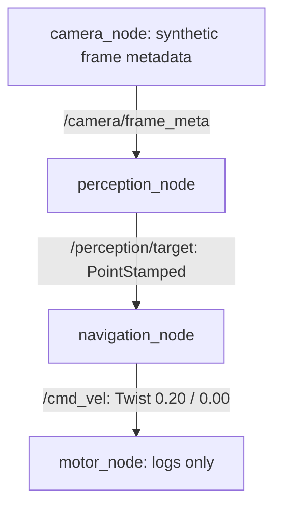
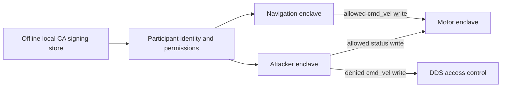
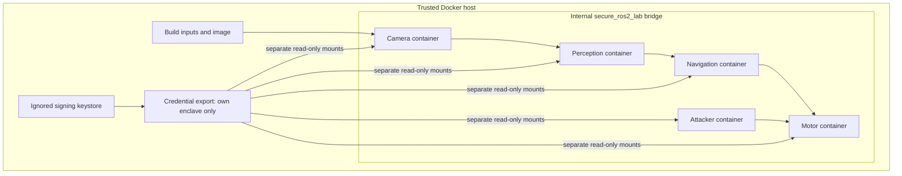

# Architecture

## Normal data flow



There is no physical motor output. The camera's one-second timer starts the
pipeline. Perception emits a constant target for metadata containing a detection;
navigation emits a recognizable constant command. Reliable QoS depth 10 is used
throughout. Standard message types avoid custom interfaces and large sensor libraries.

## Unsecured participant

```mermaid
flowchart LR
  N[Navigation] --> T[/cmd_vel]
  A[Lab attacker: domain 42] -->|0.80 / 1.00 at 5 Hz| T
  T --> M[Motor receives both]
  A -->|status at 1 Hz| M
```

The `attack` Compose profile activates the participant. Topic enumeration uses
ROS graph APIs, not IP scanners. It does not choose targets. A five-second
delay precedes the first command attempt to permit status discovery.

## Secured SROS2 flow



| Enclave | Publish | Subscribe |
|---|---|---|
| /robot/camera | /camera/frame_meta | none |
| /robot/perception | /perception/target | /camera/frame_meta |
| /robot/navigation | /cmd_vel | /perception/target |
| /robot/motor | none | /cmd_vel, /lab/attacker/status |
| /lab/attacker | /lab/attacker/status, /parameter_events | none |

The attacker has an explicit publish DENY for `/cmd_vel`; all unmatched resources
use generated default DENY. Topic names in the SROS2 policy are namespace-relative
(for example `cmd_vel` with profile `ns="/"`), then translated to DDS topic names
by SROS2. The generated signed governance enforces authenticated joining, topic
access checks, and encrypted payloads. Setup validates those properties and
refuses to export credentials if they are absent.

`/parameter_events` is allowed only for rclpy's infrastructure publisher. C++
parameter services, parameter event publishers, and rosout are disabled. Python
parameter services and rosout are disabled. ROS middleware discovery endpoints
remain governed by DDS/SROS2 behavior, rather than custom application ACL code.

## Docker trust boundaries



Docker is trusted to implement isolation. Internal bridge networking prevents
normal external routing, but does not isolate containers from the Docker host.
No host networking, device mapping, Docker socket, privileged mode, or published
ports are used. Each participant still shares a DDS domain, so authenticated
participants can expose metadata and consume resources within middleware limits.

The setup container is offline (`network_mode: none`), writes generated files
as the invoking Linux user, and exits before the experiment. Runtime containers
mount only their own exported credential directory. CA private keys are never
mounted. No remote, commit, or push is configured automatically.
